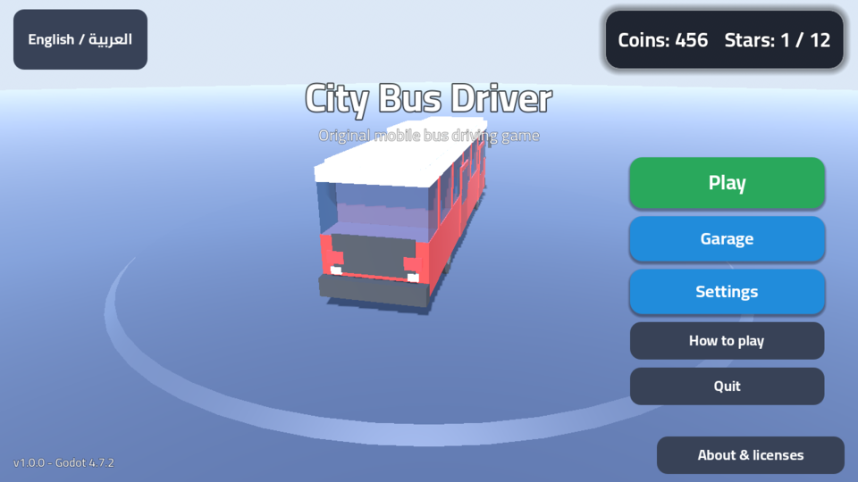
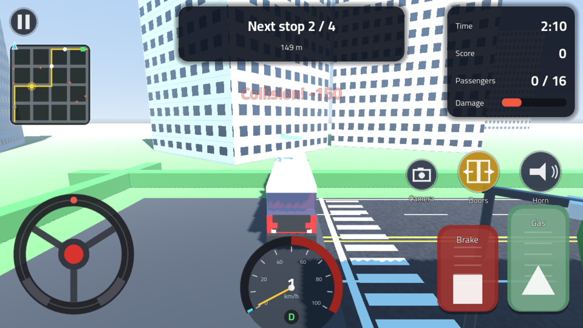
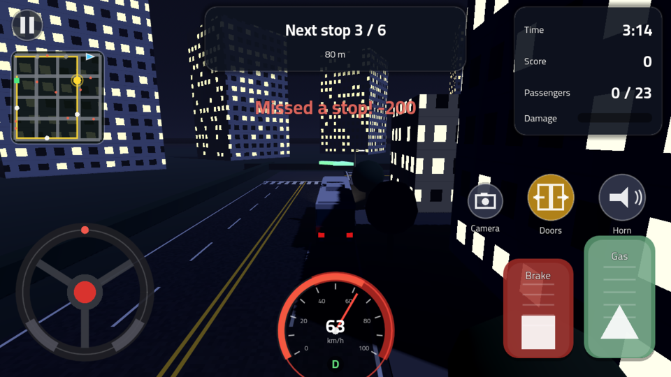
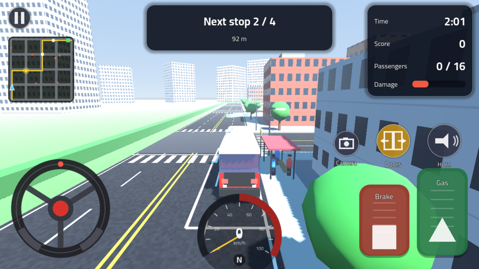
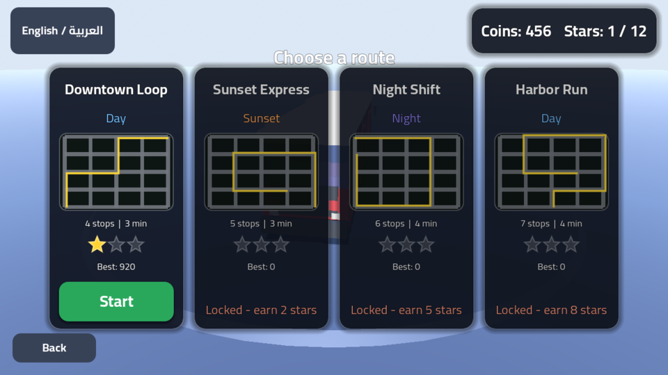

# City Bus Driver — سائق حافلة المدينة

لعبة قيادة حافلات ثلاثية الأبعاد أصلية للهواتف (Android) مبنية بمحرك **Godot Engine 4.7.2-stable**.
An original 3D city-bus driving game for Android phones, built with **Godot Engine 4.7.2-stable**
(mobile renderer, touch-first UI, Arabic + English).

> كل الأصول (النماذج، الواجهة، الأصوات، الأيقونات) مولّدة برمجياً داخل المشروع أو أصلية؛ لا توجد أي أصول منسوخة من ألعاب تجارية.
> All assets are generated procedurally by the project's own scripts or are original; nothing is copied from commercial games.

---

## التنزيل | Download (APK)

[](https://github.com/joknok72-ctrl/bus-simulator-ultimate/releases/download/citybusdriver-latest/CityBusDriver.apk)
[](https://github.com/joknok72-ctrl/bus-simulator-ultimate/actions/workflows/build-citybusdriver.yml)

**الرابط المباشر:** https://github.com/joknok72-ctrl/bus-simulator-ultimate/releases/download/citybusdriver-latest/CityBusDriver.apk

يُبنى الـ APK تلقائياً عبر GitHub Actions (`.github/workflows/build-citybusdriver.yml` في جذر المستودع) بمحرك **Godot 4.7.2-stable بالضبط** عند أي تغيير داخل مجلد `CityBusDriver/`، ويُنشر في الإصدار [`citybusdriver-latest`](https://github.com/joknok72-ctrl/bus-simulator-ultimate/releases/tag/citybusdriver-latest) — مستقل تماماً عن إصدار `latest` الخاص بلعبة Bus Simulator Ultimate في جذر المستودع. النسخة نسخة تصحيح (debug) موقّعة بمفتاح CI مؤقّت؛ عند التثبيت فعّل "التثبيت من مصادر غير معروفة".

The APK is built automatically by GitHub Actions (`.github/workflows/build-citybusdriver.yml` at the repository root) with **exactly Godot 4.7.2-stable** whenever `CityBusDriver/` changes, and published to the [`citybusdriver-latest`](https://github.com/joknok72-ctrl/bus-simulator-ultimate/releases/tag/citybusdriver-latest) release — independent of the root game's `latest` release. It is a debug build signed with a throw-away CI key; enable "install from unknown sources" on the phone.

---

## لقطات | Screenshots

| | |
|---|---|
|  |  |
|  |  |
|  |  |

اللقطات مأخوذة من المحرّك 4.7.2-stable نفسه (`tools/screenshot.gd` تحت Xvfb + Mesa). / Captured from the real engine build
(`tools/screenshot.gd` under Xvfb + Mesa software OpenGL).

---

## المحتوى | Contents

1. [الميزات | Features](#الميزات--features)
2. [طريقة اللعب والتحكم | Gameplay & controls](#طريقة-اللعب-والتحكم--gameplay--controls)
3. [المتطلبات | Requirements](#المتطلبات--requirements)
4. [التشغيل على الحاسوب | Run on desktop](#التشغيل-على-الحاسوب--run-on-desktop)
5. [بناء APK لأندرويد | Build the Android APK](#بناء-apk-لأندرويد--build-the-android-apk)
6. [التحقق والاختبارات | Validation & tests](#التحقق-والاختبارات--validation--tests)
7. [بنية المشروع | Project structure](#بنية-المشروع--project-structure)
8. [الرخص | Licenses](#الرخص--licenses)

---

## الميزات | Features

| العربية | English |
|---|---|
| مدينة ثلاثية الأبعاد مولّدة برمجياً (شبكة طرق 5×5، مبانٍ، أرصفة، إنارة، أشجار) | Procedurally generated 3D city (5×5 road grid, buildings, sidewalks, street lights, trees) |
| 4 خطوط حافلات بأوقات مختلفة من اليوم (نهار / غروب / ليل) تُفتح بالنجوم | 4 bus routes at different times of day (day / sunset / night), unlocked with stars |
| محطات، ركاب ينتظرون ويصعدون/ينزلون، أبواب تُفتح وتُغلق | Bus stops, waiting passengers that board/alight, animated doors |
| سيارات مرور، تصادمات تُخصم منها نقاط، حدّ سرعة مع تحذير | Traffic cars, collision penalties, speed limit with warning |
| نتيجة ونجوم (1–3) وعملات لشراء ألوان (طلاءات) للحافلة من المرآب | Score, 1–3 stars and coins to buy bus liveries in the garage |
| حفظ التقدّم محلياً (`user://save.cfg`) | Local save of progress (`user://save.cfg`) |
| واجهة لمس كاملة: عجلة قيادة، أزرار، أو إمالة الهاتف (Accelerometer) | Full touch UI: steering wheel, buttons, or phone tilt (accelerometer) |
| 3 كاميرات: تتبّع، مقعد السائق، من الأعلى | 3 cameras: chase, driver seat, top-down |
| خريطة صغيرة، عدّاد سرعة، مؤقّت، سهم توجيه إلى المحطة التالية | Minimap, speedometer, timer, guide arrow to the next stop |
| أصوات مولّدة برمجياً (محرك، بوق، أبواب، نقر) واهتزاز | Procedural audio (engine, horn, doors, clicks) and vibration |
| عربي/إنجليزي مع اتجاه واجهة تلقائي (RTL) | Arabic/English with automatic RTL layout |
| إعدادات: طريقة التحكم، الكاميرا، الجودة، الصوت، الاهتزاز، عكس الإمالة | Settings: control mode, camera, quality, sound, vibration, invert tilt |
| صفحة "حول اللعبة والرخص" تعرض رخصة Godot ومكوّناتها الخارجية وخط Cairo | "About & licenses" page showing the Godot license, its third-party components and the Cairo font notice |

---

## طريقة اللعب والتحكم | Gameplay & controls

**الهدف:** انطلق من المحطة الأولى، توقّف عند كل محطة على الخط (اتبع السهم والخريطة)، افتح الأبواب لصعود الركاب، ثم أنهِ الخط قبل انتهاء الوقت. التصادم أو تجاوز السرعة أو تفويت محطة يُخفض النتيجة.

**Goal:** start at the first stop, stop at every bus stop on the route (follow the arrow and the minimap), open the doors so passengers can board, and finish the route before the timer runs out. Collisions, speeding and missed stops reduce your score.

| التحكم على الهاتف | Touch | لوحة المفاتيح (للتجربة على الحاسوب) | Keyboard (desktop testing) |
|---|---|---|---|
| عجلة القيادة / زرّا يسار–يمين / إمالة الهاتف | Steering wheel / left–right buttons / tilt | `A` `D` أو الأسهم | `A` `D` or arrows |
| دوّاسة الوقود (يمين أسفل) | Gas pedal (bottom right) | `W` / `↑` | `W` / `↑` |
| دوّاسة المكابح | Brake pedal | `S` / `↓` / `Space` | `S` / `↓` / `Space` |
| زر الأبواب | Doors button | `E` | `E` |
| زر البوق | Horn button | `H` | `H` |
| زر الكاميرا | Camera button | `C` | `C` |
| زر الإيقاف المؤقت | Pause button | `Esc` / `P` | `Esc` / `P` |

طريقة التحكم تُختار من **الإعدادات** (عجلة – أزرار – إمالة). / Control mode is chosen in **Settings** (wheel – buttons – tilt).

---

## المتطلبات | Requirements

* **Godot Engine 4.7.2-stable** بالضبط (المشروع مضبوط على `config/features = "4.7"`).
  حمّل المحرّر الرسمي من `https://godotengine.org/download` — لا تستخدم إصداراً آخر.
* لبناء APK: JDK 17، Android SDK (`platform-tools` + `build-tools`) وقوالب التصدير الرسمية 4.7.2 لأندرويد.
  التفاصيل الكاملة في [`docs/ANDROID_BUILD.md`](docs/ANDROID_BUILD.md).

* Exactly **Godot Engine 4.7.2-stable** (`config/features = "4.7"`). Download the official editor from
  `https://godotengine.org/download`. Do not substitute another version.
* For the APK: JDK 17, an Android SDK (`platform-tools` + `build-tools`) and the official 4.7.2 Android export
  templates. See [`docs/ANDROID_BUILD.md`](docs/ANDROID_BUILD.md).

---

## التشغيل على الحاسوب | Run on desktop

```sh
# افتح المشروع في المحرّر (استيراد أول مرة يستغرق ثوانٍ قليلة)
Godot_v4.7.2-stable_linux.x86_64 --path /path/to/CityBusDriver --editor

# أو شغّله مباشرة (الفأرة تُحاكي اللمس)
Godot_v4.7.2-stable_linux.x86_64 --path /path/to/CityBusDriver
```

ملاحظة: في أول استيراد لمستودع نظيف يطبع المحرّر بعض أخطاء "Cannot open file ... .translation / FontFile" لأن الموارد المستوردة لم تُنشأ بعد؛ تختفي عند التشغيل الثاني. / On the very first import of a clean checkout Godot prints a few "Cannot open file … .translation / FontFile" errors because imported resources do not exist yet; they disappear on the second run.

---

## بناء APK لأندرويد | Build the Android APK

الطريقة المختصرة (Linux، بعد تجهيز JDK 17 وAndroid SDK حسب `docs/ANDROID_BUILD.md`):

```sh
export GODOT=/path/to/Godot_v4.7.2-stable_linux.x86_64
export JAVA_HOME=/usr/lib/jvm/java-17-openjdk-amd64
export ANDROID_HOME=/opt/android-sdk
sh tools/build_android.sh            # يحمّل قوالب أندرويد الرسمية إن لزم، يستورد المشروع ويصدّر build/CityBusDriver-debug.apk
```

للنسخة النهائية الموقّعة (release) مرّر مفتاح التوقيع الخاص بك:

```sh
RELEASE_KEYSTORE=/secure/my-release.keystore RELEASE_KEY_ALIAS=upload RELEASE_KEY_PASS='***' sh tools/build_android.sh
```

Short version (Linux, after preparing JDK 17 and the Android SDK as in `docs/ANDROID_BUILD.md`): run
`sh tools/build_android.sh`. It fetches the official Android templates if missing, imports the project and exports
`build/CityBusDriver-debug.apk`; pass `RELEASE_KEYSTORE`/`RELEASE_KEY_ALIAS`/`RELEASE_KEY_PASS` to also export a signed
release APK. The Android preset (`export_presets.cfg`) targets **arm64-v8a**, package `com.khaled.citybusdriver`,
version `1.0.0` (code 1), landscape, immersive mode, `VIBRATE` permission, adaptive launcher icons.

---

## التحقق والاختبارات | Validation & tests

`tools/validate.sh` يشغّل بالمحرّك 4.7.2-stable: الاستيراد، ثم اختبار الدخان `tests/smoke_test.gd` (45 فحصاً: الترجمات، صفحات القائمة، توليد المدينة، الخطوط الأربعة، القيادة والكبح، المحطات وصعود الركاب، التصادمات، إنهاء الخط والنتيجة)، ثم إقلاع المشهد الرئيسي بلا واجهة رسومية.

`tools/validate.sh` runs, with Godot 4.7.2-stable: the import, the headless smoke test `tests/smoke_test.gd`
(45 checks: translations, menu pages, city generation, all four routes, driving/braking, stops and boarding, collisions,
route completion and scoring) and a headless boot of the main scene.

```sh
GODOT=/path/to/Godot_v4.7.2-stable_linux.x86_64 sh tools/validate.sh
```

آخر نتيجة مسجّلة (2026-09-25، Godot 4.7.2.stable.official) / last recorded result:
`import errors = 0` · `45 checks, 0 failures – SMOKE TEST OK` · `boot exit 0` · debug APK exported and verified with
`apksigner` — see [`build/BUILD_INFO.txt`](build/BUILD_INFO.txt) and `build/logs/`.

`tools/screenshot.gd` يلتقط لقطات حقيقية من اللعبة (يحتاج شاشة أو Xvfb):
`xvfb-run -s "-screen 0 1280x720x24" $GODOT --path . --rendering-driver opengl3 --resolution 1280x720 -s res://tools/screenshot.gd`

> لم يُجرَّب التطبيق بعد على هاتف أندرويد فعلي (لا يوجد جهاز/محاكي في بيئة البناء). جرّبه على جهازك قبل النشر.
> The APK has not yet been run on a physical Android device (no device/emulator in the build environment) — test it on your phone before publishing.

---

## بنية المشروع | Project structure

```
project.godot            إعدادات المشروع (Mobile renderer، أفقي، لمس، عربي/إنجليزي)
export_presets.cfg       إعداد تصدير Android (arm64-v8a، com.khaled.citybusdriver)
icon.svg                 أيقونة أصلية
android/icons/           أيقونات المشغّل (عادية + adaptive)
assets/fonts/            خط Cairo (OFL) — للعربية والإنجليزية
assets/i18n/strings.csv  كل نصوص الواجهة (en / ar)
assets/ui/splash.png     شاشة الإقلاع
scenes/                  bus.tscn, game.tscn, ui/main_menu.tscn, ui/hud.tscn
scripts/autoload/        GameState (حفظ/تقدّم/إعدادات)، AudioSynth (أصوات مولّدة)
scripts/vehicle/         bus.gd (فيزياء الحافلة والأبواب)، camera_rig.gd
scripts/world/           توليد المدينة، الخطوط، المحطات، الركاب، المرور، مصنع الشبكات
scripts/ui/              القائمة، HUD، عناصر اللمس، الخريطة، العدّاد، الإيقاف، النتائج
scripts/game.gd          منطق المهمّة (المحطات، النقاط، المؤقّت، النهاية)
shaders/                 مظهر المباني والطرق
theme/main_theme.tres    سمة الواجهة
tests/smoke_test.gd      اختبار دخان بلا واجهة رسومية
tools/                   build_android.sh, validate.sh, fetch_android_templates.py, screenshot.gd
docs/ANDROID_BUILD.md    دليل تجهيز أندرويد والتصدير خطوة بخطوة
docs/screenshots/        لقطات من اللعبة
build/                   مخرجات البناء: CityBusDriver-debug.apk, BUILD_INFO.txt, logs/ (مُتجاهَلة من Godot عبر .gdignore)
```

---

## الرخص | Licenses

* كود المشروع ومشاهده وأصوله المولّدة: رخصة MIT — انظر [`LICENSE`](LICENSE).
* خط **Cairo**: SIL Open Font License 1.1 — انظر [`assets/fonts/OFL.txt`](assets/fonts/OFL.txt).
* Godot Engine: MIT — إشعار الرخصة وقائمة المكوّنات الخارجية تُعرض داخل اللعبة في صفحة "حول اللعبة والرخص".

Project code, scenes and generated assets: MIT (see `LICENSE`). Cairo font: SIL OFL 1.1 (`assets/fonts/OFL.txt`).
Godot Engine: MIT — the notice and third-party component list are shown in-game on the "About & licenses" page.
