# City Bus Driver — سائق حافلة المدينة

لعبة قيادة حافلات ثلاثية الأبعاد أصلية للهواتف (Android) مبنية بمحرك **Godot Engine 4.7.2-stable**.
An original 3D city-bus driving game for Android phones, built with **Godot Engine 4.7.2-stable**
(mobile renderer, touch-first UI, Arabic + English).

> كل الأصول (النماذج، الواجهة، الأصوات، الأيقونات) مولّدة برمجياً داخل المشروع أو أصلية؛ لا توجد أي أصول منسوخة من ألعاب تجارية.
> All assets are generated procedurally by the project's own scripts or are original; nothing is copied from commercial games.

---

## التنزيل | Download (APK)

[](https://github.com/joknok72-ctrl/bus-simulator-ultimate/releases/download/citybusdriver-latest/CityBusDriver.apk)
[](https://github.com/joknok72-ctrl/bus-simulator-ultimate/actions/workflows/build-citybusdriver.yml)

**الرابط المباشر:** https://github.com/joknok72-ctrl/bus-simulator-ultimate/releases/download/citybusdriver-latest/CityBusDriver.apk

يُبنى الـ APK تلقائياً عبر GitHub Actions (`.github/workflows/build-citybusdriver.yml`) بمحرك **Godot 4.7.2-stable بالضبط** عند كل دفعة (push) إلى الفرع `main` — مشروع Godot موجود مباشرة في جذر المستودع — ويُنشر في الإصدار [`citybusdriver-latest`](https://github.com/joknok72-ctrl/bus-simulator-ultimate/releases/tag/citybusdriver-latest). النسخة نسخة تصحيح (debug) موقّعة بمفتاح CI مؤقّت؛ عند التثبيت فعّل "التثبيت من مصادر غير معروفة". توجد أيضاً نسخة مبنية مسبقاً ومحفوظة داخل المستودع: [`build/CityBusDriver-debug.apk`](https://github.com/joknok72-ctrl/bus-simulator-ultimate/raw/main/build/CityBusDriver-debug.apk) (تفاصيلها في [`build/BUILD_INFO.txt`](build/BUILD_INFO.txt)).

The APK is built automatically by GitHub Actions (`.github/workflows/build-citybusdriver.yml`) with **exactly Godot 4.7.2-stable** on every push to `main` — the Godot project lives directly at the repository root — and published to the [`citybusdriver-latest`](https://github.com/joknok72-ctrl/bus-simulator-ultimate/releases/tag/citybusdriver-latest) release. It is a debug build signed with a throw-away CI key; enable "install from unknown sources" on the phone. A pre-built copy is also committed in the repository: [`build/CityBusDriver-debug.apk`](https://github.com/joknok72-ctrl/bus-simulator-ultimate/raw/main/build/CityBusDriver-debug.apk) (details in [`build/BUILD_INFO.txt`](build/BUILD_INFO.txt)).

---

## لقطات | Screenshots

| | |
|---|---|
| 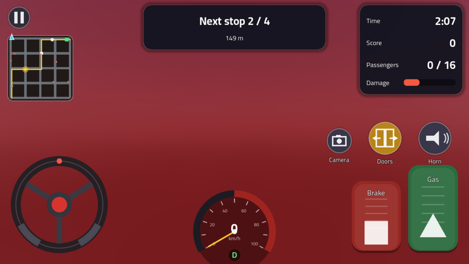 | 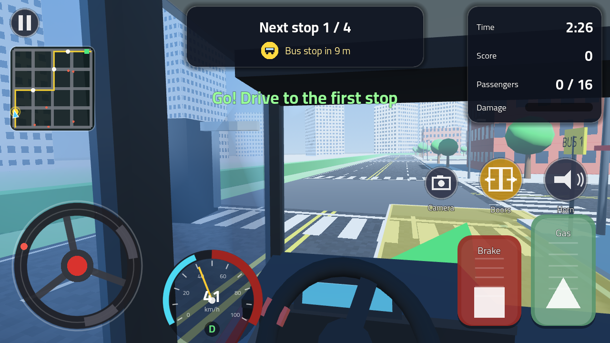 |
| 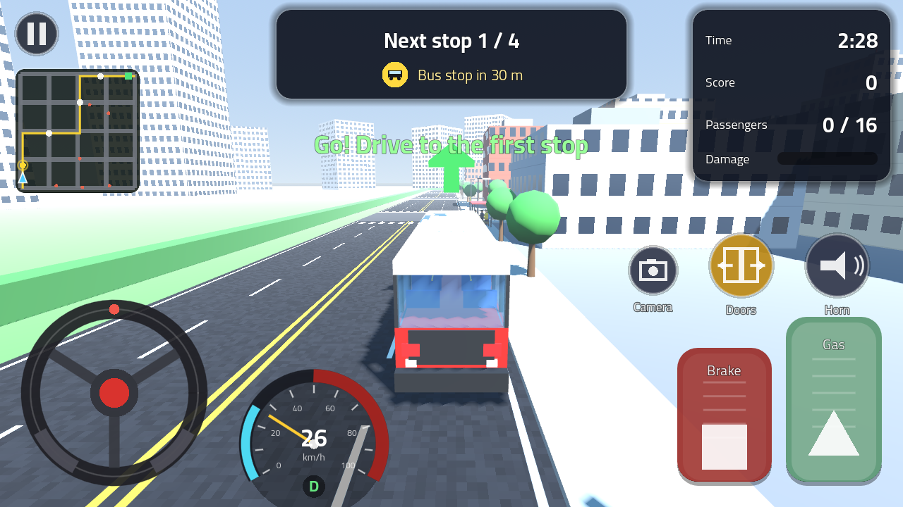 | 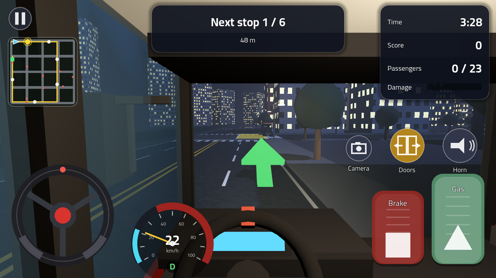 |
| 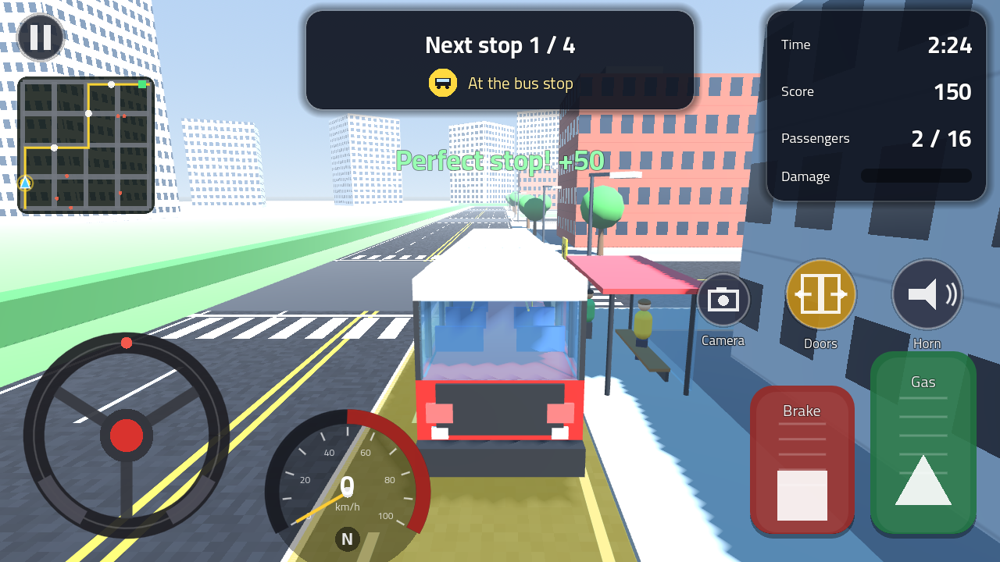 | 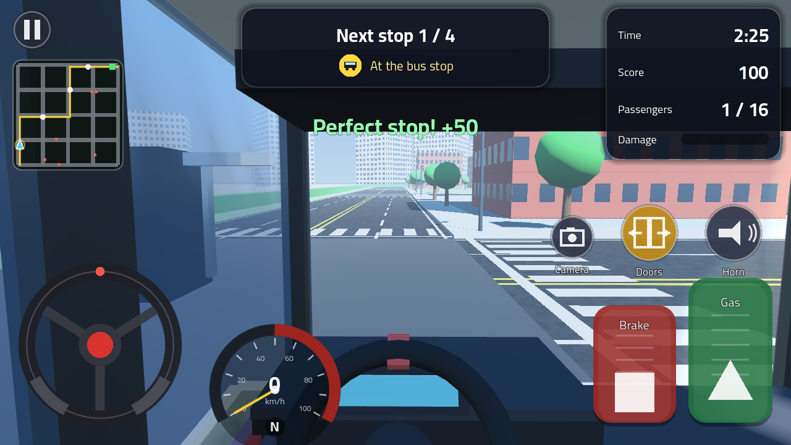 |
| 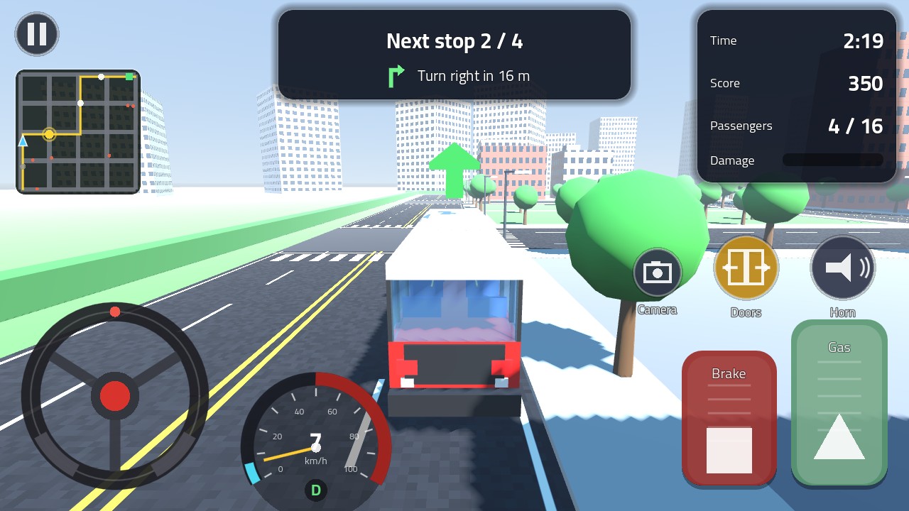 | 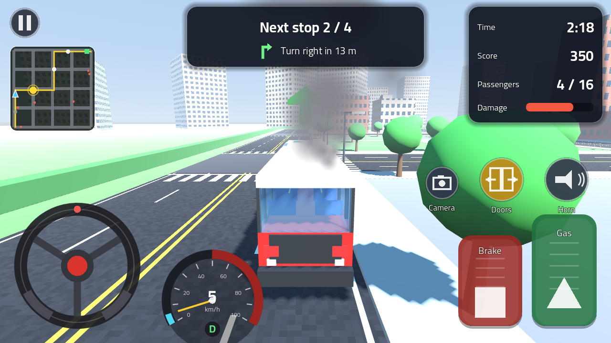 |
| 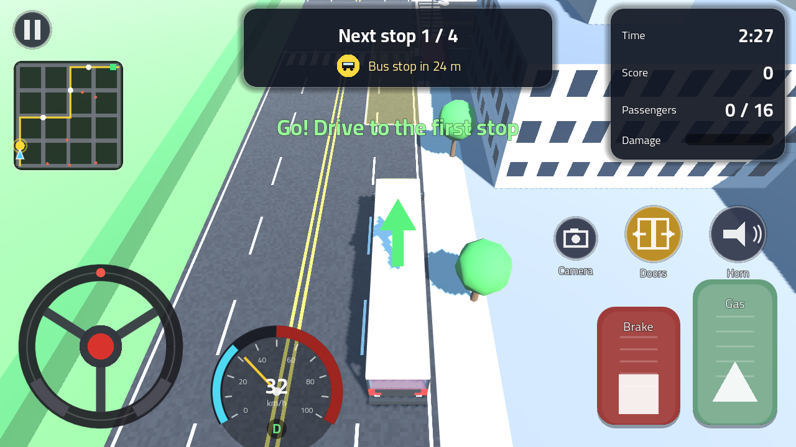 | 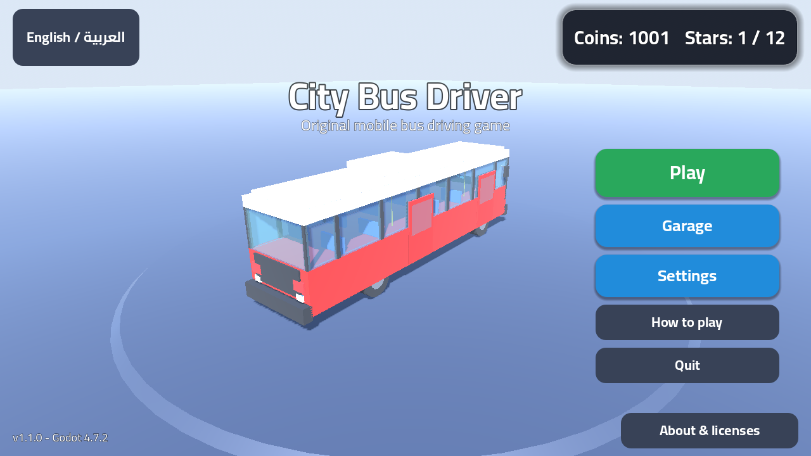 |
| 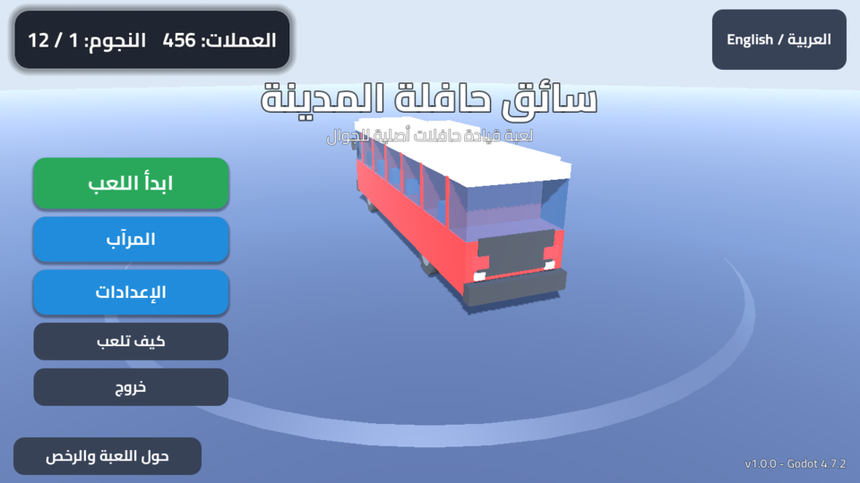 |  |

اللقطات مأخوذة من المحرّك 4.7.2-stable نفسه (`tools/screenshot.gd` تحت Xvfb + Mesa). / Captured from the real engine build
(`tools/screenshot.gd` under Xvfb + Mesa software OpenGL).

---

## المحتوى | Contents

1. [الميزات | Features](#الميزات--features)
2. [طريقة اللعب والتحكم | Gameplay & controls](#طريقة-اللعب-والتحكم--gameplay--controls)
3. [المتطلبات | Requirements](#المتطلبات--requirements)
4. [التشغيل على الحاسوب | Run on desktop](#التشغيل-على-الحاسوب--run-on-desktop)
5. [بناء APK لأندرويد | Build the Android APK](#بناء-apk-لأندرويد--build-the-android-apk)
6. [التحقق والاختبارات | Validation & tests](#التحقق-والاختبارات--validation--tests)
7. [بنية المشروع | Project structure](#بنية-المشروع--project-structure)
8. [ما الجديد في 1.3.0 | What's new in 1.3.0](#ما-الجديد-في-130--whats-new-in-130)
9. [ما الجديد في 1.2.0 | What's new in 1.2.0](#ما-الجديد-في-120--whats-new-in-120)
10. [ما الجديد في 1.1.0 | What's new in 1.1.0](#ما-الجديد-في-110--whats-new-in-110)
11. [الرخص | Licenses](#الرخص--licenses)

---

## الميزات | Features

| العربية | English |
|---|---|
| مدينة ثلاثية الأبعاد مولّدة برمجياً (شبكة طرق 5×5، مبانٍ، أرصفة، إنارة، أشجار) | Procedurally generated 3D city (5×5 road grid, buildings, sidewalks, street lights, trees) |
| 4 خطوط حافلات بأوقات مختلفة من اليوم (نهار / غروب / ليل) تُفتح بالنجوم | 4 bus routes at different times of day (day / sunset / night), unlocked with stars |
| محطات، ركاب ينتظرون ويصعدون/ينزلون، أبواب تُفتح وتُغلق | Bus stops, waiting passengers that board/alight, animated doors |
| سيارات مرور، تصادمات تُخصم منها نقاط، حدّ سرعة مع تحذير | Traffic cars, collision penalties, speed limit with warning |
| إشارات مرور في كل تقاطع (80 مدخلاً) بدورة متزامنة أخضر / أصفر / أحمر: إشارة رئيسية على الرصيف عند خط التوقف وأخرى معلّقة على ذراع في الجهة المقابلة، وسيارات المرور تتوقف عند الخط الأبيض؛ تجاوز الإشارة الحمراء بالحافلة يخصم 100 نقطة ويُفقد النجمة الثالثة، ومصباح صغير بجانب سهم الإرشاد يعرض لون الإشارة القادمة | Traffic lights at every crossing (80 approaches) on one synchronised green / amber / red cycle: a primary head on the kerb at the stop line plus a mast-arm repeater across the crossing, and traffic cars that stop at the white line; running a red light with the bus costs 100 points and the third star, and a small lamp beside the guidance arrow shows the colour of the next signal |
| نتيجة ونجوم (1–3) وعملات لشراء ألوان (طلاءات) للحافلة من المرآب | Score, 1–3 stars and coins to buy bus liveries in the garage |
| حفظ التقدّم محلياً (`user://save.cfg`) | Local save of progress (`user://save.cfg`) |
| واجهة لمس كاملة: عجلة قيادة، أزرار، أو إمالة الهاتف (Accelerometer) | Full touch UI: steering wheel, buttons, or phone tilt (accelerometer) |
| 3 كاميرات مع انتقال سلس بينها: تتبّع (تتجنّب المباني)، مقعد السائق (قمرة قيادة حقيقية: لوحة عدادات، مقود يدور مع التوجيه، أعمدة، مرايا، النظر داخل المنعطف، اهتزاز خفيف مع السرعة)، ومن الأعلى | 3 cameras with smooth blending: chase (keeps clear of buildings), driver seat (real cockpit: dashboard, steering wheel that turns with your input, pillars, mirrors, looks into turns, gentle speed vibration) and top-down |
| إرشاد انعطاف بانعطاف: سطر في أعلى الشاشة (انعطف يميناً بعد 45 م / المحطة بعد 30 م) وسهم ثلاثي الأبعاد يتبع مسار الخط (المنعطف التالي) بدل الإشارة عبر المباني، وتحذير عند الخروج عن الخط، وتعتيم الجزء المقطوع من الخط على الخريطة | Turn-by-turn guidance: a HUD line (Turn right in 45 m / Bus stop in 30 m), a 3D arrow that follows the route (next corner) instead of pointing through buildings, an off-route warning, and the driven part of the route dimmed on the minimap |
| مكافأة "توقّف مثالي" (+50) عند التوقف في منتصف منطقة المحطة بمحاذاة الرصيف؛ تُعدّ في شاشة النتائج | "Perfect stop" bonus (+50) for stopping centred in the zone and parallel to the kerb; counted on the results screen |
| خريطة صغيرة، عدّاد سرعة، مؤقّت | Minimap, speedometer, timer |
| أداء للهواتف: كل الهندسة الثابتة (الحافلة، المدينة، الطرق، المحطات، الإشارات، السيارات، الركاب) تُدمج في شبكات قليلة — نداءات الرسم أقل بنحو 57% (865 → 368 في الخط الأول، مع إشارات المرور) | Phone performance: all static geometry (bus, city, roads, stops, signals, cars, passengers) is baked into a few meshes — about 57% fewer draw calls (865 → 368 on route 1, traffic lights included) |
| واجهة تحترم منطقة الأمان (فتحة الكاميرا/الحواف المستديرة) على أندرويد | HUD respects the display safe area (camera cutout / rounded corners) on Android |
| دخان من المحرك عند تلف شديد | Engine smoke when the bus is badly damaged |
| أصوات مولّدة برمجياً (محرك، بوق، أبواب، نقر) واهتزاز | Procedural audio (engine, horn, doors, clicks) and vibration |
| عربي/إنجليزي مع اتجاه واجهة تلقائي (RTL) | Arabic/English with automatic RTL layout |
| إعدادات: طريقة التحكم، الكاميرا، الجودة، الصوت، الاهتزاز، حساسية التوجيه (منخفضة/عادية/عالية)، عكس الإمالة | Settings: control mode, camera, quality, sound, vibration, steering sensitivity (low/normal/high), invert tilt |
| صفحة "حول اللعبة والرخص" تعرض رخصة Godot ومكوّناتها الخارجية وخط Cairo | "About & licenses" page showing the Godot license, its third-party components and the Cairo font notice |

---

## طريقة اللعب والتحكم | Gameplay & controls

**الهدف:** انطلق من المحطة الأولى، توقّف عند كل محطة على الخط (اتبع سطر الإرشاد أعلى الشاشة: "انعطف يميناً بعد 45 م" / "المحطة بعد 30 م"، والسهم الأخضر، والخريطة)، افتح الأبواب لصعود الركاب، ثم أنهِ الخط قبل انتهاء الوقت. التوقف في منتصف المنطقة الصفراء بمحاذاة الرصيف يمنحك "توقّفاً مثالياً" (+50). توقّف عند الخط الأبيض عندما تكون إشارة المرور أمامك حمراء — المصباح الصغير بجانب سهم الإرشاد يعرض لونها. التصادم أو تجاوز السرعة أو تجاوز إشارة حمراء (−100) أو تفويت محطة أو الخروج عن الخط يُخفض النتيجة أو يضيّع الوقت.

**Goal:** start at the first stop, stop at every bus stop on the route (follow the guidance line at the top: "Turn right in 45 m" / "Bus stop in 30 m", the green arrow and the minimap), open the doors so passengers can board, and finish the route before the timer runs out. Stopping centred in the yellow zone and parallel to the kerb earns a "perfect stop" (+50). Stop at the white line when the traffic light ahead is red — the small lamp beside the guidance arrow shows its colour. Collisions, speeding, running a red light (−100), missed stops and leaving the route cost score or time.

| التحكم على الهاتف | Touch | لوحة المفاتيح (للتجربة على الحاسوب) | Keyboard (desktop testing) |
|---|---|---|---|
| عجلة القيادة / زرّا يسار–يمين / إمالة الهاتف | Steering wheel / left–right buttons / tilt | `A` `D` أو الأسهم | `A` `D` or arrows |
| دوّاسة الوقود (يمين أسفل) | Gas pedal (bottom right) | `W` / `↑` | `W` / `↑` |
| دوّاسة المكابح | Brake pedal | `S` / `↓` / `Space` | `S` / `↓` / `Space` |
| زر الأبواب | Doors button | `E` | `E` |
| زر البوق | Horn button | `H` | `H` |
| زر الكاميرا | Camera button | `C` | `C` |
| زر الإيقاف المؤقت | Pause button | `Esc` / `P` | `Esc` / `P` |

طريقة التحكم تُختار من **الإعدادات** (عجلة – أزرار – إمالة). / Control mode is chosen in **Settings** (wheel – buttons – tilt).

---

## المتطلبات | Requirements

* **Godot Engine 4.7.2-stable** بالضبط (المشروع مضبوط على `config/features = "4.7"`).
  حمّل المحرّر الرسمي من `https://godotengine.org/download` — لا تستخدم إصداراً آخر.
* لبناء APK: JDK 17، Android SDK (`platform-tools` + `build-tools`) وقوالب التصدير الرسمية 4.7.2 لأندرويد.
  التفاصيل الكاملة في [`docs/ANDROID_BUILD.md`](docs/ANDROID_BUILD.md).

* Exactly **Godot Engine 4.7.2-stable** (`config/features = "4.7"`). Download the official editor from
  `https://godotengine.org/download`. Do not substitute another version.
* For the APK: JDK 17, an Android SDK (`platform-tools` + `build-tools`) and the official 4.7.2 Android export
  templates. See [`docs/ANDROID_BUILD.md`](docs/ANDROID_BUILD.md).

---

## التشغيل على الحاسوب | Run on desktop

```sh
# افتح المشروع في المحرّر (استيراد أول مرة يستغرق ثوانٍ قليلة)
Godot_v4.7.2-stable_linux.x86_64 --path /path/to/CityBusDriver --editor

# أو شغّله مباشرة (الفأرة تُحاكي اللمس)
Godot_v4.7.2-stable_linux.x86_64 --path /path/to/CityBusDriver
```

ملاحظة: في أول استيراد لمستودع نظيف يطبع المحرّر بعض أخطاء "Cannot open file ... .translation / FontFile" لأن الموارد المستوردة لم تُنشأ بعد؛ تختفي عند التشغيل الثاني. / On the very first import of a clean checkout Godot prints a few "Cannot open file … .translation / FontFile" errors because imported resources do not exist yet; they disappear on the second run.

---

## بناء APK لأندرويد | Build the Android APK

الطريقة المختصرة (Linux، بعد تجهيز JDK 17 وAndroid SDK حسب `docs/ANDROID_BUILD.md`):

```sh
export GODOT=/path/to/Godot_v4.7.2-stable_linux.x86_64
export JAVA_HOME=/usr/lib/jvm/java-17-openjdk-amd64
export ANDROID_HOME=/opt/android-sdk
sh tools/build_android.sh            # يحمّل قوالب أندرويد الرسمية إن لزم، يستورد المشروع ويصدّر build/CityBusDriver-debug.apk
```

للنسخة النهائية الموقّعة (release) مرّر مفتاح التوقيع الخاص بك:

```sh
RELEASE_KEYSTORE=/secure/my-release.keystore RELEASE_KEY_ALIAS=upload RELEASE_KEY_PASS='***' sh tools/build_android.sh
```

Short version (Linux, after preparing JDK 17 and the Android SDK as in `docs/ANDROID_BUILD.md`): run
`sh tools/build_android.sh`. It fetches the official Android templates if missing, imports the project and exports
`build/CityBusDriver-debug.apk`; pass `RELEASE_KEYSTORE`/`RELEASE_KEY_ALIAS`/`RELEASE_KEY_PASS` to also export a signed
release APK. The Android preset (`export_presets.cfg`) targets **arm64-v8a**, package `com.khaled.citybusdriver`,
version `1.3.0` (code 4), landscape, immersive mode, `VIBRATE` permission, adaptive launcher icons.

---

## التحقق والاختبارات | Validation & tests

`tools/validate.sh` يشغّل بالمحرّك 4.7.2-stable: الاستيراد، ثم اختبار الدخان `tests/smoke_test.gd` (133 فحصاً: الترجمات، صفحات القائمة، توليد المدينة ودمج الهندسة، الخطوط الأربعة، القيادة والكبح، المحطات وصعود الركاب والتوقف المثالي، التصادمات والدخان، إرشاد الانعطاف والخروج عن الخط، تنازل سيارات المرور للحافلة، إشارات المرور: دورة الأطوار، هندسة التقاطعات والإشارات المدمجة، توقّف السيارات عند الخط الأحمر وانطلاقها عند الأخضر، عقوبة تجاوز الإشارة الحمراء مرة واحدة لكل تقاطع مع فترة السماح، ابتعاد المحطات ونقطة الانطلاق والمحطة النهائية عن التقاطعات، حساسية التوجيه، إنهاء الخط والنتيجة، وكاميرا السائق/التتبّع)، ثم إقلاع المشهد الرئيسي بلا واجهة رسومية.

`tools/validate.sh` runs, with Godot 4.7.2-stable: the import, the headless smoke test `tests/smoke_test.gd`
(133 checks: translations, menu pages, city generation and mesh merging, all four routes, driving/braking, stops, boarding
and the perfect-stop bonus, collisions and damage smoke, turn-by-turn guidance and off-route detection, traffic yielding
to the bus, traffic lights — phase cycle, crossing geometry and the baked signal mesh, cars stopping at a red line and
driving on at green, the red-light penalty charged once per crossing with its grace period, stops / spawn / terminal kept
clear of the crossings — steering sensitivity, route completion and scoring, and the camera rig: driver eye placement,
clear line of sight, look-into-turn, view blending, chase camera obstacle avoidance) and a headless boot of the main scene.

```sh
GODOT=/path/to/Godot_v4.7.2-stable_linux.x86_64 sh tools/validate.sh
```

يشغّل GitHub Actions السكربت نفسه قبل تصدير الـ APK ويعرض النتيجة في ملخّص التشغيل. / GitHub Actions runs the same script before exporting the APK and shows the result in the run summary.

آخر نتيجة مسجّلة (2026-09-26، Godot 4.7.2.stable.official، الإصدار 1.3.0) / last recorded result:
`import errors = 0` · `133 checks, 0 failures – SMOKE TEST OK` · `boot exit 0`. ملف [`build/BUILD_INFO.txt`](build/BUILD_INFO.txt) والـ APK المحفوظ في المستودع يصفان بناء 1.2.0؛ يُنشر APK الإصدار 1.3.0 عبر GitHub Actions عند الدفع إلى `main`. / [`build/BUILD_INFO.txt`](build/BUILD_INFO.txt) and the committed APK still describe the 1.2.0 build; the 1.3.0 APK is published by GitHub Actions on the next push to `main`.

`tools/perf_probe.gd` يطبع عدد نداءات الرسم والعناصر لكل كاميرا (يحتاج شاشة أو Xvfb) — النتيجة الحالية للخط الأول بكاميرا التتبّع: 368 نداء رسم و47 MeshInstance3D (354 و46 في 1.2.0؛ إشارات المرور كلّها شبكة واحدة بعشرة أسطح لا تُلقي ظلالاً؛ كانت 865 و587 قبل دمج الهندسة). / `tools/perf_probe.gd` prints draw calls / objects per camera (needs a display or Xvfb); route 1 chase view now: 368 draw calls, 47 MeshInstance3D (354 / 46 in 1.2.0 — all traffic lights are one 10-surface mesh that casts no shadows; 865 / 587 before mesh merging):
`xvfb-run -s "-screen 0 1280x720x24" $GODOT --path . --rendering-driver opengl3 --resolution 1280x720 -s res://tools/perf_probe.gd`

`tools/screenshot.gd` يلتقط لقطات حقيقية من اللعبة (يحتاج شاشة أو Xvfb):
`xvfb-run -s "-screen 0 1280x720x24" $GODOT --path . --rendering-driver opengl3 --resolution 1280x720 -s res://tools/screenshot.gd`

> لم يُجرَّب التطبيق بعد على هاتف أندرويد فعلي (لا يوجد جهاز/محاكي في بيئة البناء). جرّبه على جهازك قبل النشر.
> The APK has not yet been run on a physical Android device (no device/emulator in the build environment) — test it on your phone before publishing.

---

## بنية المشروع | Project structure

```
.github/workflows/       build-citybusdriver.yml — بناء APK تلقائي عبر GitHub Actions ونشره في citybusdriver-latest
project.godot            إعدادات المشروع (Mobile renderer، أفقي، لمس، عربي/إنجليزي)
export_presets.cfg       إعداد تصدير Android (arm64-v8a، com.khaled.citybusdriver)
icon.svg                 أيقونة أصلية
android/icons/           أيقونات المشغّل (عادية + adaptive)
assets/fonts/            خط Cairo (OFL) — للعربية والإنجليزية
assets/i18n/strings.csv  كل نصوص الواجهة (en / ar)
assets/ui/splash.png     شاشة الإقلاع
scenes/                  bus.tscn, game.tscn, ui/main_menu.tscn, ui/hud.tscn
scripts/autoload/        GameState (حفظ/تقدّم/إعدادات)، AudioSynth (أصوات مولّدة)
scripts/vehicle/         bus.gd (فيزياء الحافلة والأبواب والدخان)، camera_rig.gd
scripts/world/           توليد المدينة، الخطوط، المحطات، الركاب، المرور، traffic_signals.gd (إشارات المرور)، مصنع الشبكات، mesh_merger.gd (دمج الهندسة)، route_guide.gd (الإرشاد)
scripts/ui/              القائمة، HUD، عناصر اللمس، الخريطة، العدّاد، سهم الانعطاف، مؤشر الإشارة (signal_indicator.gd)، الإيقاف، النتائج
scripts/game.gd          منطق المهمّة (المحطات، النقاط، المؤقّت، مخالفات الإشارة الحمراء، النهاية)
shaders/                 مظهر المباني والطرق
theme/main_theme.tres    سمة الواجهة
tests/smoke_test.gd      اختبار دخان بلا واجهة رسومية
tools/                   build_android.sh, validate.sh, fetch_android_templates.py, screenshot.gd, perf_probe.gd
docs/ANDROID_BUILD.md    دليل تجهيز أندرويد والتصدير خطوة بخطوة
docs/screenshots/        لقطات من اللعبة (المجلد docs/ مُتجاهَل من Godot عبر .gdignore فلا يدخل في الـ APK)
build/                   مخرجات البناء: CityBusDriver-debug.apk, BUILD_INFO.txt, logs/ (مُتجاهَلة من Godot عبر .gdignore)
```

---

## ما الجديد في 1.3.0 | What's new in 1.3.0

**إشارات مرور** — كل تقاطع في شبكة 5×5 صار مُشَوَّراً: 80 مدخلاً، لكل منها خط توقف أبيض قبل ممر المشاة، إشارة رئيسية على عمود عند الرصيف بجانب الخط (تُقرأ أثناء الاقتراب) وإشارة مكرِّرة معلّقة على ذراع في الزاوية المقابلة (تُقرأ من مقعد السائق أثناء الانتظار عند الخط). الإشارات كلّها على ساعة واحدة (`TrafficSignals`): 8 ث أخضر، 2 ث أصفر، 0.6 ث أحمر للجميع، بالتناوب بين شوارع الشمال–الجنوب والشرق–الغرب (دورة 21.2 ث). تبدأ إشارة الشارع الأول حمراء وتتحوّل إلى الأخضر بعد ثوانٍ من انتهاء العدّ التنازلي. مدينة كاملة من الإشارات = شبكة واحدة بعشرة أسطح (4 مواد ثابتة + 6 مواد للمصابيح مشتركة بين كل إشارات المحور)، فتبديل الطور ستّ تحديثات مواد فقط، والمصابيح غير مظلَّلة (unshaded) كي يبقى الأحمر أحمرَ في ضوء الشمس. الساعة تتقدّم في التكّة الفيزيائية فتتوقف مع الإيقاف المؤقت.

**سيارات تلتزم بالإشارة** — تتباطأ حتى الخط الأبيض عند الأحمر (وتفحص التقاطع *التالي* على الشارع، لا زاوية حلقتها فقط، كي لا تعبر التقاطعات الوسطى على الأحمر)، وتُكمل على الأصفر إذا كانت أقرب من مسافة الكبح المريحة، وتنتظر خلف بعضها؛ الطابور خلف إشارة حمراء أو خلف الحافلة لا يُعدّ "تعطّلاً" فلا يخترقه كاسر التعطّل.

**مخالفة الإشارة الحمراء** — دخول مقدمة الحافلة إلى التقاطع والإشارة حمراء (بعد فترة سماح 0.35 ث من التحوّل) يخصم 100 نقطة مع رسالة وصوت واهتزاز، مرة واحدة لكل تقاطع؛ عدد المخالفات يظهر في شاشة النتائج، والنجمة الثالثة تتطلّب صفر مخالفات. مصباح إشارة صغير في سطر الإرشاد يعرض لون الإشارة القادمة (حتى 80 م) في كل الكاميرات.

**تخطيط الخطوط** — أُزيحت المحطات التي كانت تقع فوق التقاطعات أو على حوافها (سبع محطات كانت في مركز التقاطع تماماً، مثل المحطتين 2 و3 في الخط الأول، وتسع أخرى تتداخل معه) إلى منتصف الأحياء (≥ 16 م عن مركز أي تقاطع، يفحصه اختبار الدخان)؛ نقطة الانطلاق والمحطة النهائية ابتعدتا عن التقاطعات؛ وأُضيفت 30 ث إلى مهلة كل خط لانتظار الإشارات. سطر جديد في "كيف تلعب".

**Traffic lights** — every crossing of the 5×5 grid is now signalised: 80 approaches, each with a white stop line before the crosswalk, a primary head on a kerb pole at the line (read while approaching) and a mast-arm repeater on the far corner (read from the driver's seat while waiting at the line). All signals run on one clock (`TrafficSignals`): 8 s green, 2 s amber, 0.6 s all-red, alternating between the north–south and east–west streets (21.2 s cycle); the first light of a route starts red and turns green a few seconds after the countdown. The whole city of signals is one 10-surface mesh (4 static materials + 6 lamp materials shared by every head of an axis), so a phase change is six material updates, and the lenses are unshaded so red stays red in sunlight. The clock advances on physics ticks, so it pauses with the game.

**Traffic that obeys the lights** — cars roll to a stop at the white line on red (checking the *next* crossing along their street, not just their loop corner, so multi-block loop sides no longer run intermediate reds), commit through amber when they are too close to brake comfortably, and queue behind each other; a queue behind a red light or behind the bus never counts as a deadlock, so the deadlock breaker cannot drive through it.

**Red-light violations** — the bus's front bumper entering a crossing on red (after a 0.35 s grace period from the change) costs 100 points with a message, a sound and vibration, charged once per crossing; the count appears on the results screen and the third star now requires zero violations. A small signal lamp in the guidance row shows the colour of the next light (up to 80 m ahead) in every camera view.

**Route layout** — stops that sat on or overlapped a crossing (seven were exactly at a crossing centre, e.g. stops 2 and 3 of route 1, and nine more overlapped one) moved mid-block (≥ 16 m from any crossing centre, checked by the smoke test); the spawn point and the terminal moved further from their crossings; every route got 30 s more for waiting at lights. A new how-to line.

Validation: `tests/smoke_test.gd` grew from 84 to 133 checks (phase logic, crossing geometry, the baked signal mesh, a car stopping at red and driving on at green, the penalty / once-per-crossing / grace / green cases, route clearances). Draw calls on route 1: 354 → 368 (one mesh, no shadow pass). Version 1.3.0 (Android `versionCode` 4).

## ما الجديد في 1.2.0 | What's new in 1.2.0

**إرشاد انعطاف بانعطاف** — كان السهم الإرشادي يشير مباشرة إلى المحطة التالية "على خط مستقيم"، أي عبر المباني عند المنعطفات. الآن `RouteGuide` يُسقط موضع الحافلة على مسار الخط ويحدّد المنعطف التالي: سطر في أعلى الشاشة مع أيقونة (انعطف يساراً/يميناً بعد X م، تابع مستقيماً، المحطة بعد X م، المحطة النهائية) والسهم ثلاثي الأبعاد يشير إلى المنعطف ثم المحطة. عند الخروج عن الخط (> 22 م عن المسار) يظهر تحذير برتقالي ويشير السهم إلى نقطة العودة. الجزء المقطوع من الخط يُعتَّم على الخريطة الصغيرة.

**أداء على الهواتف** — كل شيء في اللعبة مبني من مكعبات وأسطوانات، وكان كل جزء عقدة MeshInstance3D منفصلة (الحافلة وحدها ~120، والمدينة ~250) أي نداء رسم لكل قطعة. `MeshMerger` الجديد يدمج الأجزاء الثابتة في شبكة واحدة بسطح لكل مادة: الحافلة 8 عقد بدل ~120، المدينة/الطرق/الحدود 3 شبكات، كل سيارة وراكب ومحطة شبكة واحدة. النتيجة: 354 نداء رسم بدل 865 (الخط 1) و455 بدل 1166 (الخط 4)، و46 عقدة شبكة بدل 587 — بلا أي تغيير في المظهر.

**عدالة المرور** — كانت السيارات تتوقف فقط إذا كان *مركز* الحافلة أمامها، فتصدم جانب الحافلة (11 م) عند التقاطعات. الآن تفحص مقدمة الحافلة ووسطها وخلفها.

**توقّف مثالي** — +50 عند التوقف في منتصف منطقة المحطة بمحاذاة الرصيف (يُعدّ في شاشة النتائج).

**تحكم وواجهة** — إعداد "حساسية التوجيه" (منخفضة 190° / عادية 150° / عالية 110° للعجلة، ومعدلات مقابلة للأزرار والإمالة)؛ صفحة الإعدادات صارت عمودين؛ الواجهة تبتعد عن فتحة الكاميرا (منطقة الأمان) على أندرويد؛ دخان من المحرك عند تلف > 35%؛ سطر "كيف تلعب" جديد.

**Turn-by-turn guidance** — the guide arrow used to point straight at the next stop, i.e. through the buildings at every corner. `RouteGuide` now projects the bus onto the route polyline and finds the next corner: a HUD line with an icon (Turn left/right in X m, Straight ahead, Bus stop in X m, Terminal) and a 3D arrow that aims at the corner, then at the stop. Leaving the route (> 22 m from the lane) shows an orange warning and the arrow points back. The driven part of the route is dimmed on the minimap.

**Phone performance** — everything in the game is built from boxes and cylinders, and every part used to be its own MeshInstance3D (the bus alone ~120, the city ~250), i.e. one draw call each. The new `MeshMerger` bakes static parts into one mesh with a surface per material: the bus is 8 nodes instead of ~120, city/roads/boundary are 3 meshes, every car, passenger and stop is one mesh. Result: 354 draw calls instead of 865 (route 1) and 455 instead of 1166 (route 4), 46 mesh nodes instead of 587 — with an identical look.

**Fair traffic** — cars only yielded when the bus *centre* was in front of them and would T-bone the 11 m long bus at intersections. They now check the bus front, middle and rear.

**Perfect stop** — +50 for stopping centred in the stop zone and parallel to the kerb (counted on the results screen).

**Controls and UI** — a "steering sensitivity" setting (low 190° / normal 150° / high 110° of wheel travel, matching button and tilt rates); the settings page is now two columns; the HUD keeps clear of the camera cutout (display safe area) on Android; engine smoke above 35% damage; a new how-to line.

Validation: `tests/smoke_test.gd` grew from 59 to 84 checks. Version 1.2.0 (Android `versionCode` 3).

## ما الجديد في 1.1.0 | What's new in 1.1.0

**كاميرا السائق أُعيد بناؤها** — كانت الكاميرا سابقاً تُوضَع داخل جدار جانبي مُصمَت للحافلة (ألواح النوافذ كانت صناديق بعرض الحافلة كلّه) فيظهر للّاعب لون الطلاء فقط ولا يشعر بأنه يقود. الآن:

* قمرة قيادة حقيقية داخل الحافلة: زجاج أمامي صافٍ، نوافذ جانبية رقيقة، أعمدة، لوحة عدادات مع شاشة مضيئة، مقود يدور مع التوجيه، مقعد السائق، جدران داخلية، أرضية وسقف، مقاعد الركاب ومقابض، وإضاءة داخلية دافئة ليلاً.
* نقطة عين صحيحة (`Bus.DRIVER_EYE`) خلف المقود بيسار الحافلة: الطريق والأفق وأعلى المقود كلّها في الإطار، ولا يقطع أي جسم مجال الرؤية.
* الكاميرا تتبع ميل الجسم وتنظر قليلاً داخل المنعطف بحسب سرعة دوران الحافلة الحقيقية، مع اهتزاز خفيف يزداد مع السرعة وزاوية رؤية تتّسع قليلاً عند الإسراع.
* الانتقال بين الكاميرات الثلاث سلس (0.45 ث) بلا قفزات؛ كاميرا التتبّع أصبحت أقرب قليلاً ولا تدخل المباني (كشف عوائق بشعاع)، وتحديث الكاميرا يتم بعد حركة الحافلة في نفس التكّة الفيزيائية لمنع الارتجاج، مع تفعيل `physics_interpolation`.
* السهم الإرشادي في وضع السائق يُرسَم على الطريق أمام الحافلة ويختفي عند الوصول إلى المحطة؛ عدّاد السرعة انتقل من منتصف الشاشة كي لا يحجب الحافلة في وضع التتبّع؛ العدّ التنازلي أكبر وأوضح؛ زر الرجوع في أندرويد يوقف اللعبة مؤقتاً/يعود للقائمة.

**Driver camera rebuilt** — the old driver view was placed inside a solid side wall of the bus (the window band was a full-width box), so the player saw the paint colour and never felt like driving. Now:

* A real cockpit inside the bus: clear windshield, thin side panes, pillars, dashboard with a glowing display, a steering wheel that turns with your input, driver seat, interior wall panels, floor and ceiling, passenger seats and handrails, warm cabin light at night.
* A correct eye point (`Bus.DRIVER_EYE`) behind the wheel on the left: road, horizon and the top of the wheel are in frame and nothing intersects the view.
* The camera follows body roll/pitch, looks slightly into turns from the bus's real yaw rate, vibrates gently with speed and widens its FOV a little when fast.
* Smooth 0.45 s blends between the three cameras; the chase camera is a bit closer and never clips into buildings (ray-cast obstacle avoidance); the rig updates after the bus in the same physics tick and `physics_interpolation` is on, so there is no jitter.
* The guide arrow is drawn on the road ahead in the cockpit view and hides at the stop; the speedometer moved off the screen centre so it no longer hides the bus in chase view; bigger countdown; the Android back button pauses / navigates back.

Validation: `tests/smoke_test.gd` grew from 45 to 59 checks (eye placement, clear line of sight, cockpit wheel, look-into-turn, view blending, obstacle avoidance). Version 1.1.0 (Android `versionCode` 2).

---

## الرخص | Licenses

* كود المشروع ومشاهده وأصوله المولّدة: رخصة MIT — انظر [`LICENSE`](LICENSE).
* خط **Cairo**: SIL Open Font License 1.1 — انظر [`assets/fonts/OFL.txt`](assets/fonts/OFL.txt).
* Godot Engine: MIT — إشعار الرخصة وقائمة المكوّنات الخارجية تُعرض داخل اللعبة في صفحة "حول اللعبة والرخص".

Project code, scenes and generated assets: MIT (see `LICENSE`). Cairo font: SIL OFL 1.1 (`assets/fonts/OFL.txt`).
Godot Engine: MIT — the notice and third-party component list are shown in-game on the "About & licenses" page.
